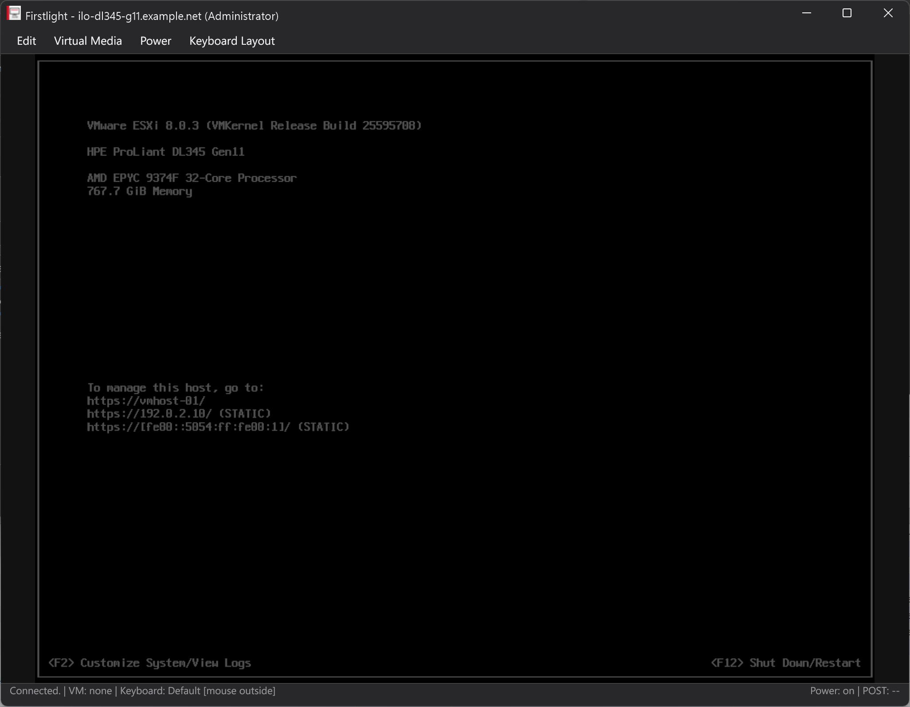

# Firstlight

**A remote console for HPE iLO and Dell iDRAC managed servers.**

> [!IMPORTANT]
> Firstlight is an independent community open-source project. It is **not affiliated with, sponsored by, endorsed by, authorized by, or otherwise connected to Hewlett Packard Enterprise (HPE) or Dell Technologies**. It is not an official HPE or Dell product, and neither vendor provides support for it.

Firstlight is a native Windows remote-console client for servers managed through HPE Integrated Lights-Out (iLO) or Dell Integrated Dell Remote Access Controller (iDRAC). It began as a community-maintained successor to the legacy `HPLOCONS` client, which is no longer actively maintained, and as a foundation for features that go beyond the original client.

It gives you full keyboard/video/mouse access to a server from power-on through BIOS/UEFI to the running operating system, plus ISO virtual media, power control and boot-override handling, as a single self-contained executable, with no browser plug-in, Java or .NET runtime required. A second executable exposes the same console stack over the Model Context Protocol, so an LLM agent can operate the console under explicit confirmation rules.

You never pick a vendor. Type the address, and Firstlight asks the controller what it is before any credentials go on the wire. See [Tested hardware](#tested-hardware).

The references to HPE, iLO, Dell and iDRAC exist only to explain which systems this software interoperates with.

Project site: **[thatiscrazy.github.io/Firstlight](https://thatiscrazy.github.io/Firstlight/)**

## Screenshots



A live remote console on an HPE ProLiant DL345 Gen11: the server's own video in the centre, the in-window menu bar above it, and the two-part status bar below it. Connection, virtual media, keyboard layout and pointer capture sit on the left, server power and POST code on the right.


The persistent multi-session launcher: saved systems on the left, the connection form on the right, drawn by the native Gio interface in the dark theme.

Host names, addresses and account names in both screenshots were replaced with documentation placeholders after capture. Nothing else in either image was altered.

## Goals

- Provide a maintained, open-source remote-console client for the two controller families that dominate x86 server rooms.
- Preserve access to systems for which the vendor client is no longer a practical option: HPE retired `HPLOCONS`, and Dell never shipped a desktop client at all.
- Offer a small, standalone Windows application without requiring a vendor client, a browser plug-in or a Java runtime.
- Treat the vendor as an implementation detail: one window, one set of keyboard maps, one automation surface, whichever controller answers.
- Keep keyboard translation extensible in data rather than in code: a new layout is a JSON file, not a pull request.
- Document and test the implementation so that it can be maintained by the community.

## What Firstlight can do

### Remote console

- Full remote KVM: live server video, keyboard and mouse, from the machine's own boot screens through BIOS/UEFI setup to the running operating system.
- Works without an installed vendor client, browser plug-in, Java runtime or .NET runtime: a single self-contained `.exe`.
- Automatic vendor detection from the address alone, using only documents a controller serves to an unauthenticated client. No vendor dropdown, no guessing.
- On HPE, speaks both remote-console protocol generations: the legacy V1 protocol used by iLO 4, including KVM and command-channel encryption, and protocol V2 or newer used by later generations. The protocol version comes from the iLO itself.
- On Dell, speaks the RFB protocol the iDRAC serves over a WebSocket, together with the vendor key exchange and control messages that surround it.
- Connection modes for a console that is already in use: request a *shared* session or *seize* the session from the current user.
- When acting as the leader of a legacy shared HPE session, incoming join requests are surfaced with an explicit Allow/Deny prompt.
- On Dell, a console held by another viewer is reported as such instead of leaving a black window, and the *Session* menu lists the other sessions or takes the console over.
- Optional TLS certificate verification for the controller HTTPS connection.

### Input and keyboard translation

- Symbolic key chords the host operating system would otherwise intercept, including `CTRL+ALT+DEL`.
- A **Ctrl+Alt+Del** button on the menu bar, on both vendors. Windows claims the real key combination as its Secure Attention Sequence before any application sees it, so a button is the only way to deliver the chord from a Windows workstation.
- Full mouse support: move, click, click-and-hold, release and scroll.
- Clipboard-to-HID paste: local clipboard text is retyped into the remote console as real keystrokes, which works even in BIOS/UEFI screens that have no clipboard of their own.
- A modular keyboard layout system translates your local layout into the US layout the server's firmware expects. US and German are built in and switch at runtime from the *Keyboard Layout* menu; further layouts are JSON files you drop next to the executable. See [Modular keyboard layout system](#modular-keyboard-layout-system).
- A selectable remote layout for the case where the far side is not US either. The *Remote Layout* menu tells Firstlight which layout the remote operating system applies to the key positions it receives, US by default and German as the second choice. See [The layout on the other side](#the-layout-on-the-other-side).

### Virtual media

- Mount a local ISO image as a virtual CD/DVD device, for OS installation, driver injection or recovery media.
- Supported on the legacy V1 and V2-or-newer HPE paths and on the Dell media channel.
- The image is always streamed outbound over the client's own connection. The controller never connects back to the workstation, so virtual media keeps working across a firewall or a NAT boundary. On Dell this deliberately avoids the Redfish `InsertMedia` route, which would require the iDRAC to reach a share on the client side.
- Mount and dismount at any time from the *Virtual Media* menu, or mount automatically at startup with `-iso`.
- Detailed transport state: whether the local media session exists, whether the transport connection is alive, whether the server firmware has recognized the device, and how many ISO bytes have been read and delivered.

### Power and management

- Momentary power press, press-and-hold, cold boot and reset, with confirmation prompts for the destructive actions.
- Live power status in the status bar, and the POST code where the firmware reports one. Dell controllers do not publish a POST code over the console channel, so that field stays empty there.
- Read the current power state and boot override through the authenticated controller session.
- Set a verified one-time virtual CD/DVD boot override without power-cycling the server.

### Sessions and credentials

- Persistent multi-session launcher: keep a list of systems of either vendor, connect to several at once, each in its own console window.
- Saved passwords are encrypted for the current Windows user with DPAPI; saving is opt-in per entry, and entries can be deleted from the launcher.
- Non-interactive start for scripts and shortcuts via `-addr`, `-name` and `-password`.
- Accepts the legacy `HPLOCONS` `-lang` argument so existing shortcuts keep working.

### User interface

- Native, GPU-rendered interface built with [Gio](https://gioui.org): no Electron, no bundled browser engine, no web view — the window is drawn directly through Direct3D 11.
- Light and dark themes follow the Windows app-theme setting and switch live, including the window title bar.
- Custom widget set in a flat, macOS-inspired style: rounded cards, an in-window menu bar with dropdowns, sheet-style confirmation dialogs, and a two-part status bar showing connection, virtual media, keyboard layout and pointer capture on the left, server power and POST code on the right.
- Uses the Segoe UI family already present on the system instead of embedding fonts, and honours per-monitor DPI.
- Keyboard input reaches the remote server only while the pointer is inside the video area, so local window and menu interaction can never leak keystrokes to the console.

### LLM / automation control (MCP bridge)

- A second, standalone executable exposes the same console stack as Model Context Protocol tools, so an LLM agent can drive a console on either vendor: open a session, watch the framebuffer, type, press chords, move the mouse, control power, set a one-time boot device and mount or unmount ISO media.
- Runs over stdio or stateless Streamable HTTP, and can hold several independent console handles to several servers at the same time.
- Designed for careful automation: idempotency keys on every mutating call, explicit `confirm: true` on destructive ones, tool annotations that mark destructive operations, and an opt-in allow-list directory for ISO mounting.

### Diagnostics

- Verbose protocol and input logging with `-debug`, or to a chosen file with `-log`, for troubleshooting firmware quirks.
- Keyboard-map loading problems are reported as warnings instead of failing the session.

## How the two controller families differ

Firstlight hides the difference, but it helps to know what is underneath when something behaves oddly.

| | HPE iLO | Dell iDRAC |
|---|---|---|
| Console transport | Proprietary IRC protocol on its own TCP port | RFB (RFC 6143) over a WebSocket on the web port |
| Video encoding | HPE's own codec | Raw, CopyRect, Hextile, RRE |
| Keyboard on the wire | USB HID scancodes | X11 keysyms |
| Authentication | Session key from the JSON login | One-shot ticket pair, second key answered in-band |
| Virtual media | SCSI tunnel on its own port | Block service on a second WebSocket |
| Power and boot | Command channel plus Redfish | Console control messages plus Redfish |
| Concurrent consoles | Firmware dependent | Six, with one virtual-media session |

Two consequences are worth knowing about.

**Keyboard layouts work differently, and better, on Dell.** iLO transports raw scancodes, so Firstlight has to translate a German keystroke into the US scancode the firmware expects; that is what the layout files in [Modular keyboard layout system](#modular-keyboard-layout-system) are for. An iDRAC takes keysyms, which name the character rather than the key position, so the controller does the mapping itself. The layout menu still applies on Dell, because chords and the clipboard typist share the same pipeline, but ordinary typing needs no layout at all there.

**A busy console behaves differently.** An iLO reports the console as busy and Firstlight offers to share or seize it. An iDRAC instead admits the second viewer and then withholds the video until the first one allows sharing. Since the factory default for that decision is `Deny Access`, a console that is already open elsewhere simply stays dark. Firstlight detects this and says so in the status bar, and the *Session* menu shows who is connected or takes the console over.

## Modular keyboard layout system

A remote console has a problem a local terminal does not: the server cannot see which keyboard is on your desk. iLO carries raw USB HID scancodes, and firmware, BIOS/UEFI and most installers read those as a US keyboard. Untranslated, the key labelled `Z` on a German board arrives as `Y`, and `@` does not arrive at all. Firstlight fixes that in data instead of in code. Every layout is a JSON file, so a new language needs no Go change, no rebuild and no pull request.

### Passwords on a console that has no layout

This is where the difference shows up first. An ESXi DCUI login, a Linux getty, a BIOS password box: the field hides what you type, so a wrong character just gives you a failed login with no clue which one it was. A password holding `!`, `/`, `@` or `-` fails three times before you start typing it blind on a US layout in your head.

Switch **Keyboard Layout** to German and the keys produce what is printed on them. The same holds for any layout you add yourself.

For the passwords that already live in a password manager, **Edit -> Paste Clipboard** is faster still. Firstlight retypes the clipboard as real HID keystrokes, one character at a time with an all-keys-up report between them, so it lands in fields that have no clipboard of their own: the ESXi DCUI login, a Linux console, a UEFI setup password box.

That paste path is nothing but HID keyboard reports on the KVM channel you already have. It never touches the iLO's own clipboard service, needs no browser plug-in and no Java, and it does not branch on the protocol version anywhere in the code. It behaves the same on iLO 5 as on the legacy V1 protocol of iLO 4, where the firmware has no clipboard feature to offer in the first place.

### Direction and inheritance

Every map translates one local source layout into key positions, named after the US layout that firmware and installers apply to them:

```
source layout (de-DE, fr-FR, ...)  ->  en-US key positions
```

When the remote operating system applies a different layout, a second step follows; [The layout on the other side](#the-layout-on-the-other-side) describes it.

A protected base map, `us-base`, holds the identity translation: 96 physical key rules and 97 clipboard character rules. A language map declares `"extends": "us-base"` and lists only what differs. The built-in German map is 20 physical rules, because the other 76 keys already behave correctly. Inheritance is resolved when the maps load, nests deeper than one level, and a map that extends itself through a cycle is rejected instead of hanging the loader.

### The layout on the other side

A remote console carries key positions, never characters. Which character a position becomes is decided entirely by the operating system on the far side, and the controller cannot tell you what that decision is: it presents a virtual USB keyboard, which sits below the operating system and is exactly why the console also works in a BIOS that has no layout at all. No Redfish endpoint, on either vendor, reports the remote keyboard layout. The in-band agents, Dell iSM and HPE AMS, report an operating system name and version and nothing about the keyboard.

Firmware, boot menus and installers read positions as US, which is the assumption everything above is built on. A running German Windows does not. There the position a US board prints `-` on carries the sharp s, so an untranslated minus key arrives as `ß`.

The *Remote Layout* menu, or `-remote-layout` on the command line, says which layout the far side applies. `en-US` is the default and changes nothing anywhere in the pipeline. Choosing `de-DE` inserts one more step: each keystroke is first resolved to the character the user meant, then encoded the way a German keyboard produces that character.

```
local keys  ->  source map  ->  character  ->  remote layout  ->  key position
```

A keystroke that carries no character passes through untouched, which covers the function keys, the arrows, every chord about positions rather than letters, and the dead keys `^`, `` ` `` and `´`, which need two presses and cannot be expressed as one stroke.

Clipboard paste follows the remote layout alone. Text is made of characters, and which keys produce them is a property of the far side, not of the keyboard on your desk.

For a German server you want both halves: *Keyboard Layout* set to German so the umlaut keys are recognised, and *Remote Layout* set to German so they arrive. With the Default source layout the ASCII keys are correct but the umlauts are not, because that path reads the local keys through a US table and never sees an `ö` in the first place.

The tables behind this were not written by hand. They were read out of the Windows layout DLLs with `MapVirtualKeyEx` and `ToUnicodeEx`, every key position in its plain, shifted and AltGr state, for both layouts.

### The two rule kinds

**Physical rules** rewrite one source key, per modifier state. This is the German `7`, which carries `/` on Shift and `{` on AltGr:

```json
{
  "input": "7",
  "plain": { "key": "DIGIT_7" },
  "shift": { "key": "SLASH" },
  "altGr": { "key": "LEFT_BRACKET", "modifiers": ["left_shift"] }
}
```

**Text rules** drive clipboard paste, where Firstlight retypes local clipboard text as real keystrokes so it works in BIOS/UEFI screens that have no clipboard:

```json
{ "char": "@", "strokes": [ { "key": "DIGIT_2", "modifiers": ["left_shift"] } ] }
```

A stroke sequence may be longer than one press. Because the remote target is always US, `us-base` already covers every character a US keyboard can produce, so most language maps need no text rules at all. The built-in German map defines none.

### How a keystroke resolves

- State priority is AltGr, then Shift, then plain.
- A key with a `plain` rule but no `shift` rule falls back to the plain stroke plus `left_shift`, so the common case needs one line.
- Ctrl, Alt and GUI combinations bypass language translation entirely. `CTRL+C` stays `CTRL+C` and `CTRL+ALT+DEL` keeps working regardless of the selected map.
- `{ "suppress": true }` marks a source key that has no portable US equivalent; it is swallowed rather than mistyped.
- A clipboard character that neither the map nor its base defines is counted and reported after the paste instead of being silently dropped.

### Key vocabulary

| Field | Accepts |
|---|---|
| `input` | `A`-`Z`, `0`-`9`, `ENTER`, `ESCAPE`, `TAB`, `SPACE`, `BACKSPACE`, `OEM_1`-`OEM_7`, `OEM_102`, `OEM_MINUS`, `OEM_PLUS`, `OEM_COMMA`, `OEM_PERIOD`, `F1`-`F12`, navigation, keypad and lock keys, or `VK_0xNN` for any other Windows virtual key |
| `key` | USB HID usage names such as `DIGIT_1`, `SEMICOLON`, `GRAVE`, `NON_US_BACKSLASH`, `KEYPAD_ADD`, or `HID_0xNN` for a raw usage code |
| `modifiers` | `left_ctrl`, `left_shift`, `left_alt`, `left_gui` and their `right_` counterparts |

The `VK_0xNN` and `HID_0xNN` forms are the escape hatch for keys with no friendly alias. Raw HID codes in the modifier range `0xE0`-`0xE7` are rejected, because modifiers belong in `modifiers`.

### Adding a layout

1. Choose **Keyboard Layout → Export built-in German map...**. Firstlight writes a working `german.json` next to an English authoring guide, as one atomic pair with rollback, so a failed export never leaves half a file behind.
2. Edit the copy, or hand the guide and the JSON Schema to an LLM. The guide contains a prompt template written for exactly that.
3. Put the finished `.json` file directly into the `keyboard-maps` directory beside `Firstlight.exe` and restart. It appears in the **Keyboard Layout** menu under its own `displayName`.

`keyboard-maps` and `keyboard-maps/_examples` are created at every start, and the examples directory is rewritten each time with the current `german.json`, `german-map-guide.md` and `keyboard-map.schema.json`. Only files directly in `keyboard-maps` are loaded, so the examples never compete with your own maps.

### Validation and failure isolation

Maps are parsed strictly. A file is rejected when it is larger than 1 MiB, contains unknown or trailing JSON, sets a `schemaVersion` other than `1`, uses an `id` that is not lowercase `[a-z0-9._-]`, omits `displayName` or `sourceLocale`, sets `targetLocale` to anything but `en-US`, claims the protected id `us-base`, duplicates a physical input or a text character, names an unknown key or modifier, or combines `suppress` with a key.

A rejected map never takes the application down with it. Every problem becomes a startup warning, the remaining maps stay selectable, and the session continues. If an external file that shadows a built-in map fails to build, the built-in map is restored in its place. Two external files claiming the same `id` cancel each other out, so a forgotten copy cannot silently win.

The complete format, the full symbolic name tables and a validation checklist live in the exported guide and in [`keyboard-map.schema.json`](internal/keyboardmap/assets/keyboard-map.schema.json).

### Beyond the desktop client

The MCP bridge uses the same translation layer: `ilo_console_type_text` types through the built-in US or German map, so an agent pasting a German password produces the same HID strokes the desktop client would. The bridge has no remote-layout selection yet and always types for a US remote.

## Tested hardware

| Server generation | Management processor | Remote-console protocol | Status |
|---|---|---|---|
| HPE ProLiant Gen10 | iLO 5 | V2 or newer | Fully tested |
| HPE ProLiant Gen10 Plus | iLO 5 | V2 or newer | Fully tested |
| HPE ProLiant Gen11 | iLO 6 | V2 or newer | KVM core tested |
| HPE ProLiant Gen12 | iLO 7 | V2 or newer | KVM core tested |
| HPE ProLiant Gen8 / Gen9 | iLO 4 | V1 (legacy) | Expected to work; not yet confirmed |
| Dell PowerEdge R750 | iDRAC9, firmware 7.10.30.00 | RFB over WebSocket | Fully tested |
| Dell PowerEdge 15G / 16G | iDRAC9 | RFB over WebSocket | Expected to work; not yet confirmed |
| Dell PowerEdge 14G | iDRAC9, older firmware | RFB over WebSocket | Expected to work; not yet confirmed |
| Dell PowerEdge 12G / 13G | iDRAC7 / iDRAC8 | Unknown | Untested |

*Fully tested* means verified end to end: console video, keyboard and mouse input, clipboard paste, power actions, one-time boot override, ISO virtual media, and the MCP bridge.

*KVM core tested* means the remote-console core, that is connecting, video, keyboard and mouse, was confirmed working on that generation. The surrounding features are built on the same code paths and are expected to behave the same, but have not been individually re-verified there.

*Untested* means nobody has pointed Firstlight at that combination. It is not a statement that it fails.

Both HPE remote-console protocol generations are implemented, so the remaining combinations are expected to work without changes: iLO 4 systems over the legacy V1 path, everything from iLO 5 onwards over the V2-or-newer path.

On the Dell side, every measurement behind the implementation comes from iDRAC9. iDRAC7 and iDRAC8 have never been tried, and the honest answer about them is that nobody here knows. Those generations ship a different console client, but a different client does not necessarily mean a different protocol underneath, and the reverse holds as well. Trying one is cheap and safe: vendor detection reads the unauthenticated Redfish root before any credentials leave the workstation, and a controller that answers differently, or that refuses the console channel, ends up with a failed connection rather than with anything changed on the server. A report either way would be genuinely useful.

Virtual Console and Virtual Media require an Enterprise or Datacenter licence on Dell. That is a firmware restriction, not a limitation of this client.

If you run Firstlight against a generation or firmware revision that is not listed above, a short report of what worked is welcome.

## Current scope and limitations

- Windows is currently the supported desktop platform.
- On HPE, remote KVM supports legacy protocol V1 (used by iLO 4) and protocol V2 or newer. Compatibility can still vary between firmware revisions.
- On Dell, the implementation was written against and verified on iDRAC9. Whether iDRAC7 and iDRAC8 work is untested and unknown; see [Tested hardware](#tested-hardware).
- Dell controllers allow six concurrent console sessions and exactly one virtual-media session, and the console timeout is disabled in the factory configuration. Firstlight sends the keep-alive and the leave notification the firmware expects, so its own sessions are released when a window closes; a client that is killed outright still leaves a slot occupied until the controller reclaims it.
- A Dell console that is already in use admits a second viewer only after the first one allows it. With the factory default of `Deny Access` that approval never arrives, and Firstlight reports the console as held rather than showing an empty window.
- The POST code in the status bar is filled on HPE only. Dell controllers do not publish one over the console channel.
- Legacy V1 takeover and shared sessions are supported. Joining a shared V1 session opens a listener on the returned remote-console port; Windows Firewall and the network path must allow the current session leader to connect back to that port. Join requests shown to the session leader are denied automatically before the reverse-listener window expires.
- Virtual media supports ISO images as virtual CD/DVD media on both protocol V1 and V2-or-newer connections.
- A client that joins a legacy shared session receives KVM/input access only; power controls and virtual media remain owned by the session leader.
- Keyboard maps translate a local source layout into key positions. Which characters those positions produce is decided by the remote layout, US unless the *Remote Layout* menu says otherwise. Characters neither side can produce are counted and skipped during clipboard input, and the dead keys are not translated at all.
- Compatibility can vary by controller generation, firmware, licensing, and server configuration.
- This is an independent implementation. Test carefully before relying on it for production recovery workflows.

## Building from source

Requirements:

- Windows
- Go 1.25 or newer

From PowerShell:

```powershell
git clone https://github.com/ThatIsCraZy/Firstlight.git
Set-Location Firstlight
go test ./...
go build -trimpath -ldflags '-H=windowsgui' -o Firstlight.exe ./cmd/firstlight
go build -trimpath -o Firstlight-mcp.exe ./cmd/firstlight-mcp
```

The generated executables are self-contained. Build products are intentionally not stored in the source tree; published binaries should be attached to GitHub Releases.

### Windows resources (icon, manifest, version metadata)

Each command embeds its icon, application manifest and VERSIONINFO block through a
committed `versioninfo.syso`, generated from `versioninfo.json` with
[`goversioninfo`](https://github.com/josephspurrier/goversioninfo). Regenerate the
`.syso` files only after changing an icon, manifest or version number:

```powershell
go install github.com/josephspurrier/goversioninfo/cmd/goversioninfo@latest
Push-Location cmd/firstlight
goversioninfo -64 -o versioninfo.syso versioninfo.json
Pop-Location
Push-Location cmd/firstlight-mcp
goversioninfo -64 -o versioninfo.syso versioninfo.json
Pop-Location
```

The GUI client additionally embeds [`Firstlight.exe.manifest`](cmd/firstlight/Firstlight.exe.manifest),
which requests per-monitor DPI awareness and Common Controls v6.

## Running

Start `Firstlight.exe` without arguments to open the launcher. Saved passwords are encrypted for the current Windows user with DPAPI.

The client can also be started directly:

```powershell
.\Firstlight.exe -addr 192.0.2.10 -name Administrator -password 'your-password'
```

Common options:

| Option | Purpose |
|---|---|
| `-addr` | Controller hostname or IP address, optionally followed by the HTTPS port. The vendor is detected automatically |
| `-name` | Controller user name |
| `-password` | Controller password |
| `-share` | Request a shared remote-console session when the console is busy |
| `-seize` | Take the console even when it is busy. On iDRAC this also closes the other sessions of this user |
| `-iso` | Mount a local ISO as virtual CD/DVD media after connecting |
| `-remote-layout` | Keyboard layout of the remote operating system: `en-US` (default) or `de-DE` |
| `-verify-cert` | Verify the controller HTTPS certificate |
| `-debug` | Enable verbose protocol and input logging |
| `-log` | Write verbose logging to a specified file |

`-share` and `-seize` are mutually exclusive.

On a Dell controller, `-seize` ends the other web sessions of the same user, which is what releases the console slots they hold. Those slots come free a moment later rather than instantly, and the sessions it ends may belong to a colleague, so it is never done automatically. The same action is available while connected from the *Session* menu, which asks first.

> [!WARNING]
> A password supplied on the command line may be visible to other local processes. Prefer the interactive launcher on shared systems. TLS certificate verification is disabled by default because iLO and iDRAC both ship with self-signed certificates; use `-verify-cert` whenever the controller certificate is trusted by the local system.

## MCP bridge

`Firstlight-mcp.exe` is a standalone translation layer between an MCP client and the console implementations for both vendors. It does not import the desktop application or its `internal/login` credential store, does not enumerate saved launcher sessions, and does not read the current Windows user's DPAPI-protected `cred.json`.

### Protocol conformance

The bridge is built on the official [MCP Go SDK](https://github.com/modelcontextprotocol/go-sdk) v1.7.0 and implements the current generation of the Model Context Protocol rather than the original 2024 draft:

- Protocol-version negotiation covers every revision the SDK supports, from `2024-11-05` up to `2026-07-28`. The bridge negotiates the newest revision the connected client also understands, so both modern and older MCP clients can connect.
- The HTTP transport is **Streamable HTTP**, the transport that replaced the deprecated HTTP+SSE transport. It runs in the specification's *stateless* mode: each HTTP request is an independent protocol connection and no MCP transport session is stored server-side.
- Every tool publishes a generated JSON Schema for both its input and its structured output, so clients get validated arguments and machine-readable results instead of free-form text.
- Tool annotations (`readOnlyHint`, `destructiveHint`, `idempotentHint`, `openWorldHint`) are set per tool so a client can apply its own approval policy before a destructive console action.
- Long-running calls honour MCP request cancellation: a cancelled `ilo_console_observe` wait returns instead of holding the console.

The design follows the architecture described in Cloudflare's write-up of the
2026-07-28 revision, [*MCP Next Generation*](https://blog.cloudflare.com/mcp-v2/)
(often referred to informally as "MCP v2", although the specification itself is
versioned by date rather than by a major number). Concretely:

| Change described there | Status in this bridge |
|---|---|
| Stateless protocol core — no `Mcp-Session-Id`, no server-side session state | **Adopted.** The HTTP handler is created with `Stateless: true`; console state lives behind an explicit `console_handle` instead of a transport session |
| Streamable HTTP replacing HTTP+SSE | **Adopted** |
| `Mcp-Method` / `Mcp-Name` request headers for gateway-level inspection | **Handled by the SDK's** `NewStreamableHTTPHandler`, so they apply without bridge-specific code |
| Multi Round-Trip Requests (MRTR) replacing stream-based elicitation | **Not used.** Confirmation is handled by the bridge's own `operation_id` idempotency keys and `confirm: true` arguments, which keep every call a single round trip |
| `ttlMs` / `cacheScope` caching hints on list and read operations | **Not used.** A live framebuffer is not usefully cacheable; freshness is expressed through `frame_revision` and `after_revision` instead |
| Authorization evolution (DCR deprecation, Client ID Metadata Documents, RFC 9207) | **Not applicable.** This release exposes HTTP on loopback only and implements no HTTP authorization layer |

Statelessness is the part that shaped the bridge most: because no transport session
survives a request, anything that must persist between calls had to become an
explicit, revocable handle. That is why `ilo_console_open` returns a
`console_handle` with its own TTL rather than relying on the transport to remember
which server a client was talking to.

The MCP client must pass a controller address or DNS name, username, and password to `ilo_console_open`. These values are used only to establish that live console connection. The password and username are not written to disk or retained in the console object, and a disconnected console is not automatically reconnected. The live session key, network connections, framebuffer, and retry records exist in process memory only until the handle is closed, expires, or the bridge exits.

The default stdio transport is suitable for a locally launched MCP server:

```json
{
  "mcpServers": {
    "hpe-ilo": {
      "command": "C:\\Program Files\\Firstlight\\Firstlight-mcp.exe"
    }
  }
}
```

For clients that require Streamable HTTP, start the bridge explicitly:

```powershell
.\Firstlight-mcp.exe -transport http -listen 127.0.0.1:8765 -endpoint /mcp
```

Virtual media is disabled by default. To allow ISO mounting for this MCP
process, configure one explicit root directory, for example the demo root:

```powershell
.\Firstlight-mcp.exe -iso-root C:\iso
```

Only non-empty regular `.iso` files whose canonical path remains below that
root are accepted. The bridge rejects directory traversal, symlinks and
Windows reparse points. Keep the root writable only by trusted local
administrators: path validation cannot protect against an attacker who can
replace files concurrently after validation.

A live remote console is necessarily stateful at the protocol level, while the HTTP transport is stateless, so tools refer to the console through the opaque `console_handle` returned by `ilo_console_open`. Multiple handles can control multiple systems concurrently, of either vendor. Idle handles expire after 15 minutes by default; adjust this with `-session-ttl`.

Available tools:

| Tool | Purpose |
|---|---|
| `ilo_console_open` | Open an ephemeral console from client-supplied connection parameters |
| `ilo_console_observe` | Return connection state and the latest framebuffer, optionally waiting up to 30 seconds for a newer `frame_revision` |
| `ilo_console_type_text` | Type text using a built-in US or German keyboard map |
| `ilo_console_press_keys` | Send a symbolic chord such as `CTRL+ALT+DELETE` or `F12` |
| `ilo_console_mouse` | Move, click, hold, release, or scroll the remote pointer |
| `ilo_console_power` | Send a confirmed power-button, cold-boot, or reset action |
| `ilo_console_management_status` | Read `PowerState` and the current boot override through the existing authenticated session |
| `ilo_console_set_one_time_boot` | Set and verify a confirmed one-time virtual CD/DVD boot override without resetting the server |
| `ilo_console_close` | Release input, close the console channels, and log out from the controller |
| `ilo_console_mount_iso` | Mount one confirmed ISO from `-iso-root` as virtual CD/DVD media |
| `ilo_console_virtual_media_status` | Return safe mount, transport, device-ready, ISO-byte-counter, and filename state |
| `ilo_console_unmount_iso` | Confirmed removal of the current virtual-media ISO |

> [!NOTE]
> The `ilo_` prefix on the tool names is historical: the bridge predates Dell support. The names are kept so existing MCP client configurations keep working, and every tool operates on whichever controller the address belongs to.


Mutating tools and `ilo_console_open` require a client-generated `operation_id`. Reuse an ID only when retrying the exact same call; this prevents a transport retry from typing, clicking, changing the boot override, resetting, mounting, or unmounting twice. Power, one-time boot override, ISO mount, and ISO unmount additionally require `confirm: true`. The one-time boot tool currently accepts only `device: "cd"`, changes only the Redfish next-boot override, and never resets or power-cycles the server. MCP annotations describe destructive operations, but the MCP client remains responsible for its own approval policy. MCP console opens always use `busy_mode: fail`; the bridge never requests a shared or seize session.

For waiting observation, pass the previous `state.frame_revision` as `after_revision` and a `wait_ms` value from 1 through 30000. The call returns when a real framebuffer change arrives, the console disconnects, the request is cancelled, or the wait expires. A zero `wait_ms` always returns the current state immediately. Virtual-media `read_bytes` counts ISO payload loaded from disk, while `delivered_bytes` counts ISO payload accepted by the controller transport. `mounted` alone means that the local media session exists; `transport_alive` and `device_ready` distinguish an active connection from firmware having recognized the virtual CD device.

Security notes:

- stdio is the preferred transport. HTTP is deliberately restricted to an explicit loopback address because this release does not implement HTTP authentication or remote exposure.
- The bridge verifies the controller HTTPS certificate by default. `insecure_skip_verify: true` is an explicit per-connection compatibility opt-out and permits man-in-the-middle attacks.
- Treat the returned `console_handle` as a bearer capability. Any MCP caller that possesses it can observe or operate that live console until it is closed or expires.
- The bridge does not log MCP request bodies, passwords, console handles, or full ISO paths. Virtual-media status returns only a safe ISO filename. The MCP client, LLM provider, process supervisor, or a local proxy may still record tool arguments; configure those components accordingly and use a dedicated least-privilege controller account.
- Run the bridge under a dedicated service account when an operating-system-level boundary from the desktop user's saved sessions is required.

## Third-party packages and acknowledgements

Firstlight is built with a small set of permissively licensed Go modules. The table
below lists every module compiled into the released executables, direct and
transitive alike:

| Module | How it is used | License | Copyright holder / authors |
|---|---|---|---|
| [`gioui.org`](https://gioui.org) | GPU-rendered user interface: window, layout, text shaping and the custom widget set | Unlicense OR MIT | The Gio Authors |
| [`gioui.org/shader`](https://git.sr.ht/~eliasnaur/gio-shaders) | Precompiled shaders used by Gio's renderer | Unlicense OR MIT | The Gio Authors |
| [`github.com/go-text/typesetting`](https://github.com/go-text/typesetting) | Font parsing, shaping and line breaking, via Gio | Unlicense OR BSD-3-Clause | The go-text Authors |
| [`github.com/lxn/win`](https://github.com/lxn/win) | Win32 API bindings for raw keyboard input, window chrome, the application icon and the file dialogs | BSD-3-Clause | The win Authors |
| [`github.com/modelcontextprotocol/go-sdk`](https://github.com/modelcontextprotocol/go-sdk) | MCP server, tool schemas, stdio and stateless Streamable HTTP | Apache-2.0 (with MIT transition notice) | The Go MCP SDK Authors |
| [`golang.org/x/sys`](https://pkg.go.dev/golang.org/x/sys) | Low-level Windows system interfaces | BSD-3-Clause | The Go Authors |
| [`golang.org/x/image`](https://pkg.go.dev/golang.org/x/image) | Image resampling for the application icon, and font data via Gio | BSD-3-Clause | The Go Authors |
| [`golang.org/x/text`](https://pkg.go.dev/golang.org/x/text) | Unicode segmentation used by Gio's text layout | BSD-3-Clause | The Go Authors |
| [`golang.org/x/exp`](https://pkg.go.dev/golang.org/x/exp) | Generic helpers used by Gio and the typesetting stack | BSD-3-Clause | The Go Authors |
| [`golang.org/x/net`](https://pkg.go.dev/golang.org/x/net) | HTTP/2 support in the MCP SDK's HTTP transport | BSD-3-Clause | The Go Authors |
| [`github.com/google/jsonschema-go`](https://github.com/google/jsonschema-go) | JSON Schema generation and validation for MCP tool arguments, via the MCP SDK | MIT | JSON Schema Go Project Authors |
| [`github.com/segmentio/encoding`](https://github.com/segmentio/encoding) | Fast JSON encoding, via the MCP SDK | MIT | Segment.io, Inc. |
| [`github.com/segmentio/asm`](https://github.com/segmentio/asm) | SIMD helpers used by `segmentio/encoding` | MIT-0 | Segment |
| [`github.com/yosida95/uritemplate/v3`](https://github.com/yosida95/uritemplate) | RFC 6570 URI templates for MCP resource URIs | BSD-3-Clause | Kohei Yoshida |
| [`golang.org/x/oauth2`](https://pkg.go.dev/golang.org/x/oauth2) | OAuth 2.0 client support in the MCP SDK's HTTP transport | BSD-3-Clause | The Go Authors |
| [`golang.org/x/sync`](https://pkg.go.dev/golang.org/x/sync) | Concurrency primitives used by the MCP SDK | BSD-3-Clause | The Go Authors |
| [`golang.org/x/time`](https://pkg.go.dev/golang.org/x/time) | Rate limiting used by the MCP SDK | BSD-3-Clause | The Go Authors |
| [`gopkg.in/Knetic/govaluate.v3`](https://github.com/Knetic/govaluate) | Expression evaluation, via the MCP SDK | MIT | George Lester |

Exact versions are pinned in [`go.mod`](go.mod) and cryptographically verified by
[`go.sum`](go.sum). The complete copyright notices and license texts for all of the
above are reproduced in [`THIRD_PARTY_NOTICES.md`](THIRD_PARTY_NOTICES.md) and ship
with every release archive, as those licenses require.

Nothing in that table is used by the protocol code itself. The console stacks for
both vendors, the WebSocket client and the RFB implementation are written against
the Go standard library alone, which is why the executables stay self-contained
and why a protocol fix never waits on an upstream release.

Two published specifications carried the Dell work, and they deserve naming:
[RFC 6455](https://www.rfc-editor.org/rfc/rfc6455.html) for the WebSocket layer and
[RFC 6143](https://www.rfc-editor.org/rfc/rfc6143.html) for the Remote Framebuffer
protocol. Only the vendor-specific parts around them had to be determined by
analysis, and those are written down in
[`IDRAC-Wireprotokol.md`](IDRAC-Wireprotokol.md).

Our sincere thanks go to the Walk Authors, the win Authors, the Go MCP SDK Authors,
the Go Authors, the JSON Schema Go Project Authors, Segment, Kohei Yoshida, George
Lester, and all contributors to these projects. Their work makes this independent
open-source client possible.

## Development

Run the complete regression suite and static checks before submitting changes:

```powershell
go test ./...
go vet ./...
```

Contributions are welcome. Keep protocol changes focused and add regression tests. See [How the protocol was determined](#how-the-protocol-was-determined) for what must not be submitted.

## License

Firstlight's own source code and documentation are released under the
[Apache License, Version 2.0](LICENSE). Apache-2.0 permits use, modification,
distribution and commercial use, and it adds two things that matter for a project
like this one: an express patent grant from every contributor, and an explicit
statement in Section 6 that the license grants **no** rights to anyone's trade
names or trademarks.

The [`NOTICE`](NOTICE) file carries the non-affiliation statement, the trademark
attribution, and the interoperability statement. Apache-2.0 Section 4(d) requires
anyone who redistributes Firstlight to pass that file along, so those
clarifications travel with every downstream copy.

This license applies only to material owned by this project's contributors. It does
**not** grant any patent, copyright, trademark, branding or other rights belonging
to HPE or to any other third party.

## How the protocol was determined

Firstlight is an independently written client. It contains no source code, no
binaries, no resources and no artwork originating from HPE, from Dell, or from any
client software of either vendor, and this repository deliberately ships none of
that material.

Public HPE documentation names the TCP services used by the Integrated Remote
Console but does not define their application-layer wire formats. On the Dell
side the console transport needed no analysis at all: it is the Remote Framebuffer
protocol of [RFC 6143](https://www.rfc-editor.org/rfc/rfc6143.html) carried over a
WebSocket of [RFC 6455](https://www.rfc-editor.org/rfc/rfc6455.html), both
published standards, and both are implemented here from those documents. What Dell
does not specify is the framing around that transport, the ticketing, the in-band
key exchange, the control messages and the virtual-media channel. Those formats,
on both vendors, were therefore determined by analysing the observable behaviour
of each protocol, principally the traffic on the wire, for the single purpose of
making an independent client interoperate with these management processors. The
results are documented in
[`ILO-Wireprotokol.md`](ILO-Wireprotokol.md) and
[`IDRAC-Wireprotokol.md`](IDRAC-Wireprotokol.md), which label every material
claim as *Verified*, *Observed* or *Inferred* rather than presenting guesses as
facts.

In the European Union this kind of interoperability analysis is expressly
permitted:

- **Article 6 of Directive 2009/24/EC** and its German implementation in
  **Section 69e UrhG** permit the acts necessary to obtain the information needed
  to achieve the interoperability of an independently created program.
- **Section 69g(2) UrhG** renders contractual provisions that purport to forbid
  those acts void.
- The Court of Justice of the European Union held in **C-406/10 (SAS Institute v.
  World Programming)** that a program's functionality, its interfaces and its data
  formats are not themselves protected by copyright, so reimplementing observed
  protocol behaviour does not reproduce a protected work.

Firstlight's purpose is interoperability with these management processors, not the
reproduction of any vendor client's internal structure or expression. Contributions
must respect that boundary: do not submit vendor binaries, firmware, decompiled
proprietary sources, extracted resources, credentials or debug logs.

## Trademark and non-affiliation notice

Hewlett Packard Enterprise, HPE, iLO, Integrated Lights-Out, HPLOCONS, ProLiant, associated product names, and any related logos or marks are trademarks or registered trademarks of Hewlett Packard Enterprise Company and/or its affiliates.

Dell, Dell Technologies, iDRAC, Integrated Dell Remote Access Controller, PowerEdge, OpenManage, associated product names, and any related logos or marks are trademarks or registered trademarks of Dell Inc. and/or its subsidiaries.

**All rights in those marks remain with their respective owners.**

Their names are used in this project solely in a descriptive and nominative manner to identify the systems with which the software is intended to interoperate. That reference does not imply affiliation, sponsorship, certification, endorsement, or approval by HPE or Dell.

This project, its authors, maintainers, and contributors are independent of both vendors. For official products, documentation, firmware, licensing, and support, consult HPE or Dell through their official channels.

## Warranty disclaimer

The software is provided “as is”, without warranty of any kind. Out-of-band management provides powerful access to server hardware; you are responsible for validating the software and protecting credentials, certificates, networks, and managed systems in your environment.
