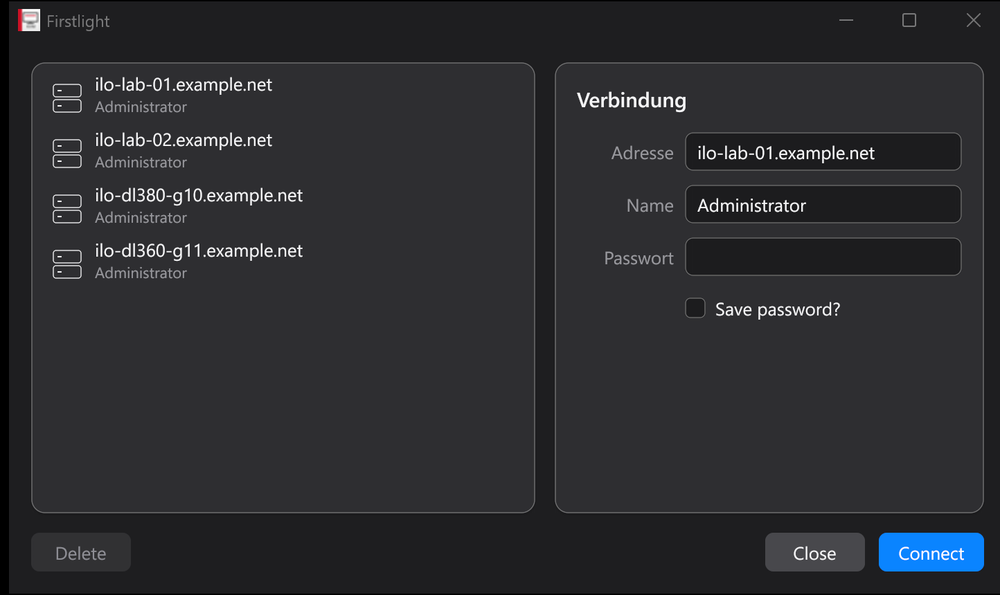

# Firstlight

**A remote console for HPE iLO managed servers.**

> [!IMPORTANT]
> Firstlight is an independent community open-source project. It is **not affiliated with, sponsored by, endorsed by, authorized by, or otherwise connected to Hewlett Packard Enterprise (HPE)**. It is not an official HPE product, and HPE does not provide support for it.

Firstlight is a native Windows remote-console client for servers managed through HPE Integrated Lights-Out (iLO). It is intended as a community-maintained successor to the legacy `HPLOCONS` client, which is no longer actively maintained, and as a foundation for features that go beyond the original client.

It gives you full keyboard/video/mouse access to a server from power-on through BIOS/UEFI to the running operating system, plus ISO virtual media, power control and boot-override handling — as a single self-contained executable, with no browser plug-in, Java or .NET runtime required. A second executable exposes the same console stack over the Model Context Protocol, so an LLM agent can operate the console under explicit confirmation rules. Successfully tested on HPE ProLiant Gen10 and Gen10 Plus, with the remote-console core additionally confirmed on Gen11 and Gen12; see [Tested hardware](#tested-hardware).

The references to HPE and iLO exist only to explain which systems this software interoperates with.

## Screenshot



The persistent multi-session launcher: saved iLO systems on the left, the connection form on the right, drawn by the native Gio interface in the dark theme. Host names and accounts in the screenshot are placeholders.

## Goals

- Provide a maintained, open-source iLO remote-console client.
- Preserve access to systems for which the legacy client is no longer a practical option.
- Offer a small, standalone Windows application without requiring the original HPE client.
- Make keyboard translation, clipboard input, virtual media, and future language support extensible.
- Document and test the implementation so that it can be maintained by the community.

## What Firstlight can do

### Remote console

- Full remote KVM: live server video, keyboard and mouse, from the machine's own boot screens through BIOS/UEFI setup to the running operating system.
- Works without an installed HPE client, browser plug-in, Java runtime or .NET runtime — a single self-contained `.exe`.
- Speaks both remote-console protocol generations: the legacy V1 protocol used by iLO 4 (including KVM and command-channel encryption) and protocol V2 or newer used by later generations. The protocol version is detected automatically from the iLO itself.
- Connection modes for a console that is already in use: request a *shared* session or *seize* the session from the current user.
- When acting as the leader of a legacy shared session, incoming join requests are surfaced with an explicit Allow/Deny prompt.
- Optional TLS certificate verification for the iLO HTTPS connection.

### Input and keyboard translation

- Symbolic key chords the host operating system would otherwise intercept, including `CTRL+ALT+DEL`.
- Full mouse support: move, click, click-and-hold, release and scroll.
- Clipboard-to-HID paste: local clipboard text is retyped into the remote console as real keystrokes, which works even in BIOS/UEFI screens that have no clipboard of their own.
- Modular JSON keyboard maps translate a local source layout into the remote US layout. US and German maps are built in and selectable at runtime from the *Keyboard Layout* menu.
- Additional layouts need no code change: drop a JSON map into the `keyboard-maps` directory next to the executable and it appears in the menu.
- The built-in German map can be exported as a template, and an English authoring guide plus a JSON Schema document the format — including an LLM prompt template for generating a new layout.
- Characters that a map cannot express are counted and reported instead of being silently mistyped.

### Virtual media

- Mount a local ISO image as a virtual CD/DVD device, for OS installation, driver injection or recovery media.
- Supported on both the legacy V1 and the V2-or-newer protocol path.
- Mount and dismount at any time from the *Virtual Media* menu, or mount automatically at startup with `-iso`.
- Detailed transport state: whether the local media session exists, whether the transport connection is alive, whether the server firmware has recognized the device, and how many ISO bytes have been read and delivered.

### Power and management

- Momentary power press, press-and-hold, cold boot and reset, with confirmation prompts for the destructive actions.
- Live power and POST status in the status bar where the firmware reports it.
- Read the current power state and boot override through the authenticated iLO session.
- Set a verified one-time virtual CD/DVD boot override without power-cycling the server.

### Sessions and credentials

- Persistent multi-session launcher: keep a list of iLO systems, connect to several at once, each in its own console window.
- Saved passwords are encrypted for the current Windows user with DPAPI; saving is opt-in per entry, and entries can be deleted from the launcher.
- Non-interactive start for scripts and shortcuts via `-addr`, `-name` and `-password`.
- Accepts the legacy `HPLOCONS` `-lang` argument so existing shortcuts keep working.

### User interface

- Native, GPU-rendered interface built with [Gio](https://gioui.org): no Electron, no bundled browser engine, no web view — the window is drawn directly through Direct3D 11.
- Light and dark themes follow the Windows app-theme setting and switch live, including the window title bar.
- Custom widget set in a flat, macOS-inspired style: rounded cards, an in-window menu bar with dropdowns, sheet-style confirmation dialogs, and a two-part status bar showing connection, virtual media, keyboard layout and pointer capture on the left, server power and POST code on the right.
- Uses the Segoe UI family already present on the system instead of embedding fonts, and honours per-monitor DPI.
- Keyboard input reaches the remote server only while the pointer is inside the video area, so local window and menu interaction can never leak keystrokes to the console.

### LLM / automation control (MCP bridge)

- A second, standalone executable exposes the same console stack as Model Context Protocol tools, so an LLM agent can drive an iLO console: open a session, watch the framebuffer, type, press chords, move the mouse, control power, set a one-time boot device and mount or unmount ISO media.
- Runs over stdio or stateless Streamable HTTP, and can hold several independent console handles to several servers at the same time.
- Designed for careful automation: idempotency keys on every mutating call, explicit `confirm: true` on destructive ones, tool annotations that mark destructive operations, and an opt-in allow-list directory for ISO mounting.

### Diagnostics

- Verbose protocol and input logging with `-debug`, or to a chosen file with `-log`, for troubleshooting firmware quirks.
- Keyboard-map loading problems are reported as warnings instead of failing the session.

## Tested hardware

| Server generation | Management processor | Remote-console protocol | Status |
|---|---|---|---|
| HPE ProLiant Gen10 | iLO 5 | V2 or newer | Fully tested |
| HPE ProLiant Gen10 Plus | iLO 5 | V2 or newer | Fully tested |
| HPE ProLiant Gen11 | iLO 6 | V2 or newer | KVM core tested |
| HPE ProLiant Gen12 | iLO 7 | V2 or newer | KVM core tested |
| HPE ProLiant Gen8 / Gen9 | iLO 4 | V1 (legacy) | Expected to work; not yet confirmed |

*Fully tested* means verified end to end: console video, keyboard and mouse input, clipboard paste, power actions, one-time boot override, ISO virtual media, and the MCP bridge.

*KVM core tested* means the remote-console core — connecting, video, keyboard and mouse — was confirmed working on that generation. The surrounding features are built on the same code paths and are expected to behave the same, but have not been individually re-verified there.

Both remote-console protocol generations are implemented, so the remaining combinations are expected to work without changes — iLO 4 systems over the legacy V1 path, everything from iLO 5 onwards over the V2-or-newer path. If you run Firstlight against a generation or firmware revision that is not listed above, a short report of what worked is welcome.

## Current scope and limitations

- Windows is currently the supported desktop platform.
- Remote KVM supports legacy protocol V1 (used by iLO 4) and protocol V2 or newer. Compatibility can still vary between firmware revisions.
- Legacy V1 takeover and shared sessions are supported. Joining a shared V1 session opens a listener on the returned remote-console port; Windows Firewall and the network path must allow the current session leader to connect back to that port. Join requests shown to the session leader are denied automatically before the reverse-listener window expires.
- Virtual media supports ISO images as virtual CD/DVD media on both protocol V1 and V2-or-newer connections.
- A client that joins a legacy shared session receives KVM/input access only; power controls and virtual media remain owned by the session leader.
- Keyboard maps translate a local source layout to a remote US layout. Characters without a defined HID sequence are skipped during clipboard input.
- Compatibility can vary by iLO generation, firmware, licensing, and server configuration.
- This is an independent implementation. Test carefully before relying on it for production recovery workflows.

## Building from source

Requirements:

- Windows
- Go 1.25 or newer

From PowerShell:

```powershell
git clone https://github.com/ThatIsCraZy/Firstlight.git
Set-Location Firstlight
go test ./...
go build -trimpath -ldflags '-H=windowsgui' -o Firstlight.exe ./cmd/firstlight
go build -trimpath -o Firstlight-mcp.exe ./cmd/firstlight-mcp
```

The generated executables are self-contained. Build products are intentionally not stored in the source tree; published binaries should be attached to GitHub Releases.

### Windows resources (icon, manifest, version metadata)

Each command embeds its icon, application manifest and VERSIONINFO block through a
committed `versioninfo.syso`, generated from `versioninfo.json` with
[`goversioninfo`](https://github.com/josephspurrier/goversioninfo). Regenerate the
`.syso` files only after changing an icon, manifest or version number:

```powershell
go install github.com/josephspurrier/goversioninfo/cmd/goversioninfo@latest
Push-Location cmd/firstlight
goversioninfo -64 -o versioninfo.syso versioninfo.json
Pop-Location
Push-Location cmd/firstlight-mcp
goversioninfo -64 -o versioninfo.syso versioninfo.json
Pop-Location
```

The GUI client additionally embeds [`Firstlight.exe.manifest`](cmd/firstlight/Firstlight.exe.manifest),
which requests per-monitor DPI awareness and Common Controls v6.

## Running

Start `Firstlight.exe` without arguments to open the launcher. Saved passwords are encrypted for the current Windows user with DPAPI.

The client can also be started directly:

```powershell
.\Firstlight.exe -addr 192.0.2.10 -name Administrator -password 'your-password'
```

Common options:

| Option | Purpose |
|---|---|
| `-addr` | iLO hostname or IP address, optionally followed by the HTTPS port |
| `-name` | iLO user name |
| `-password` | iLO password |
| `-share` | Request a shared remote-console session when the console is busy |
| `-seize` | Request takeover of a busy remote-console session |
| `-iso` | Mount a local ISO as virtual CD/DVD media after connecting |
| `-verify-cert` | Verify the iLO HTTPS certificate |
| `-debug` | Enable verbose protocol and input logging |
| `-log` | Write verbose logging to a specified file |

`-share` and `-seize` are mutually exclusive.

> [!WARNING]
> A password supplied on the command line may be visible to other local processes. Prefer the interactive launcher on shared systems. TLS certificate verification is disabled by default because many iLO installations use self-signed certificates; use `-verify-cert` whenever the iLO certificate is trusted by the local system.

## MCP bridge

`Firstlight-mcp.exe` is a standalone translation layer between an MCP client and the existing iLO/KVM protocol implementation. It does not import the desktop application or its `internal/login` credential store, does not enumerate saved launcher sessions, and does not read the current Windows user's DPAPI-protected `cred.json`.

### Protocol conformance

The bridge is built on the official [MCP Go SDK](https://github.com/modelcontextprotocol/go-sdk) v1.7.0 and implements the current generation of the Model Context Protocol rather than the original 2024 draft:

- Protocol-version negotiation covers every revision the SDK supports, from `2024-11-05` up to `2026-07-28`. The bridge negotiates the newest revision the connected client also understands, so both modern and older MCP clients can connect.
- The HTTP transport is **Streamable HTTP**, the transport that replaced the deprecated HTTP+SSE transport. It runs in the specification's *stateless* mode: each HTTP request is an independent protocol connection and no MCP transport session is stored server-side.
- Every tool publishes a generated JSON Schema for both its input and its structured output, so clients get validated arguments and machine-readable results instead of free-form text.
- Tool annotations (`readOnlyHint`, `destructiveHint`, `idempotentHint`, `openWorldHint`) are set per tool so a client can apply its own approval policy before a destructive console action.
- Long-running calls honour MCP request cancellation: a cancelled `ilo_console_observe` wait returns instead of holding the console.

The design follows the architecture described in Cloudflare's write-up of the
2026-07-28 revision, [*MCP Next Generation*](https://blog.cloudflare.com/mcp-v2/)
(often referred to informally as "MCP v2", although the specification itself is
versioned by date rather than by a major number). Concretely:

| Change described there | Status in this bridge |
|---|---|
| Stateless protocol core — no `Mcp-Session-Id`, no server-side session state | **Adopted.** The HTTP handler is created with `Stateless: true`; console state lives behind an explicit `console_handle` instead of a transport session |
| Streamable HTTP replacing HTTP+SSE | **Adopted** |
| `Mcp-Method` / `Mcp-Name` request headers for gateway-level inspection | **Handled by the SDK's** `NewStreamableHTTPHandler`, so they apply without bridge-specific code |
| Multi Round-Trip Requests (MRTR) replacing stream-based elicitation | **Not used.** Confirmation is handled by the bridge's own `operation_id` idempotency keys and `confirm: true` arguments, which keep every call a single round trip |
| `ttlMs` / `cacheScope` caching hints on list and read operations | **Not used.** A live framebuffer is not usefully cacheable; freshness is expressed through `frame_revision` and `after_revision` instead |
| Authorization evolution (DCR deprecation, Client ID Metadata Documents, RFC 9207) | **Not applicable.** This release exposes HTTP on loopback only and implements no HTTP authorization layer |

Statelessness is the part that shaped the bridge most: because no transport session
survives a request, anything that must persist between calls had to become an
explicit, revocable handle. That is why `ilo_console_open` returns a
`console_handle` with its own TTL rather than relying on the transport to remember
which server a client was talking to.

The MCP client must pass an iLO address or DNS name, username, and password to `ilo_console_open`. These values are used only to establish that live console connection. The password and username are not written to disk or retained in the console object, and a disconnected console is not automatically reconnected. The live iLO session key, network connections, framebuffer, and retry records exist in process memory only until the handle is closed, expires, or the bridge exits.

The default stdio transport is suitable for a locally launched MCP server:

```json
{
  "mcpServers": {
    "hpe-ilo": {
      "command": "C:\\Program Files\\Firstlight\\Firstlight-mcp.exe"
    }
  }
}
```

For clients that require Streamable HTTP, start the bridge explicitly:

```powershell
.\Firstlight-mcp.exe -transport http -listen 127.0.0.1:8765 -endpoint /mcp
```

Virtual media is disabled by default. To allow ISO mounting for this MCP
process, configure one explicit root directory, for example the demo root:

```powershell
.\Firstlight-mcp.exe -iso-root C:\iso
```

Only non-empty regular `.iso` files whose canonical path remains below that
root are accepted. The bridge rejects directory traversal, symlinks and
Windows reparse points. Keep the root writable only by trusted local
administrators: path validation cannot protect against an attacker who can
replace files concurrently after validation.

A live remote console is necessarily stateful at the iLO protocol level, while the HTTP transport is stateless, so tools refer to the console through the opaque `console_handle` returned by `ilo_console_open`. Multiple handles can control multiple iLO systems concurrently. Idle handles expire after 15 minutes by default; adjust this with `-session-ttl`.

Available tools:

| Tool | Purpose |
|---|---|
| `ilo_console_open` | Open an ephemeral console from client-supplied iLO connection parameters |
| `ilo_console_observe` | Return connection state and the latest framebuffer, optionally waiting up to 30 seconds for a newer `frame_revision` |
| `ilo_console_type_text` | Type text using a built-in US or German keyboard map |
| `ilo_console_press_keys` | Send a symbolic chord such as `CTRL+ALT+DELETE` or `F12` |
| `ilo_console_mouse` | Move, click, hold, release, or scroll the remote pointer |
| `ilo_console_power` | Send a confirmed power-button, cold-boot, or reset action |
| `ilo_console_management_status` | Read `PowerState` and the current boot override through the existing authenticated iLO session |
| `ilo_console_set_one_time_boot` | Set and verify a confirmed one-time virtual CD/DVD boot override without resetting the server |
| `ilo_console_close` | Release input, close the KVM channels, and log out from iLO |
| `ilo_console_mount_iso` | Mount one confirmed ISO from `-iso-root` as virtual CD/DVD media |
| `ilo_console_virtual_media_status` | Return safe mount, transport, device-ready, ISO-byte-counter, and filename state |
| `ilo_console_unmount_iso` | Confirmed removal of the current virtual-media ISO |

Mutating tools and `ilo_console_open` require a client-generated `operation_id`. Reuse an ID only when retrying the exact same call; this prevents a transport retry from typing, clicking, changing the boot override, resetting, mounting, or unmounting twice. Power, one-time boot override, ISO mount, and ISO unmount additionally require `confirm: true`. The one-time boot tool currently accepts only `device: "cd"`, changes only the Redfish next-boot override, and never resets or power-cycles the server. MCP annotations describe destructive operations, but the MCP client remains responsible for its own approval policy. MCP console opens always use `busy_mode: fail`; the bridge never requests a shared or seize session.

For waiting observation, pass the previous `state.frame_revision` as `after_revision` and a `wait_ms` value from 1 through 30000. The call returns when a real framebuffer change arrives, the console disconnects, the request is cancelled, or the wait expires. A zero `wait_ms` always returns the current state immediately. Virtual-media `read_bytes` counts ISO payload loaded from disk, while `delivered_bytes` counts ISO payload accepted by the iLO transport. `mounted` alone means that the local media session exists; `transport_alive` and `device_ready` distinguish an active connection from firmware having recognized the virtual CD device.

Security notes:

- stdio is the preferred transport. HTTP is deliberately restricted to an explicit loopback address because this release does not implement HTTP authentication or remote exposure.
- The bridge verifies the iLO HTTPS certificate by default. `insecure_skip_verify: true` is an explicit per-connection compatibility opt-out and permits man-in-the-middle attacks.
- Treat the returned `console_handle` as a bearer capability. Any MCP caller that possesses it can observe or operate that live console until it is closed or expires.
- The bridge does not log MCP request bodies, passwords, console handles, or full ISO paths. Virtual-media status returns only a safe ISO filename. The MCP client, LLM provider, process supervisor, or a local proxy may still record tool arguments; configure those components accordingly and use a dedicated least-privilege iLO account.
- Run the bridge under a dedicated service account when an operating-system-level boundary from the desktop user's saved sessions is required.

## Keyboard maps

At startup, the application creates a `keyboard-maps` directory beside the executable. Valid JSON files directly inside that directory become selectable keyboard layouts after the next application restart.

The **Keyboard Layout** menu provides:

- `Default` physical input behavior.
- All valid built-in and external maps.
- `Export built-in German map...`, which writes a loadable JSON template and an accompanying English Markdown guide for humans and LLMs.

Generated references are stored under `keyboard-maps/_examples`. See the exported guide and JSON schema for the complete map format, symbolic HID names, modifiers, inheritance rules, and validation checklist.

## Third-party packages and acknowledgements

Firstlight is built with a small set of permissively licensed Go modules. The table
below lists every module compiled into the released executables, direct and
transitive alike:

| Module | How it is used | License | Copyright holder / authors |
|---|---|---|---|
| [`gioui.org`](https://gioui.org) | GPU-rendered user interface: window, layout, text shaping and the custom widget set | Unlicense OR MIT | The Gio Authors |
| [`gioui.org/shader`](https://git.sr.ht/~eliasnaur/gio-shaders) | Precompiled shaders used by Gio's renderer | Unlicense OR MIT | The Gio Authors |
| [`github.com/go-text/typesetting`](https://github.com/go-text/typesetting) | Font parsing, shaping and line breaking, via Gio | Unlicense OR BSD-3-Clause | The go-text Authors |
| [`github.com/lxn/win`](https://github.com/lxn/win) | Win32 API bindings for raw keyboard input, window chrome, the application icon and the file dialogs | BSD-3-Clause | The win Authors |
| [`github.com/modelcontextprotocol/go-sdk`](https://github.com/modelcontextprotocol/go-sdk) | MCP server, tool schemas, stdio and stateless Streamable HTTP | Apache-2.0 (with MIT transition notice) | The Go MCP SDK Authors |
| [`golang.org/x/sys`](https://pkg.go.dev/golang.org/x/sys) | Low-level Windows system interfaces | BSD-3-Clause | The Go Authors |
| [`golang.org/x/image`](https://pkg.go.dev/golang.org/x/image) | Image resampling for the application icon, and font data via Gio | BSD-3-Clause | The Go Authors |
| [`golang.org/x/text`](https://pkg.go.dev/golang.org/x/text) | Unicode segmentation used by Gio's text layout | BSD-3-Clause | The Go Authors |
| [`golang.org/x/exp`](https://pkg.go.dev/golang.org/x/exp) | Generic helpers used by Gio and the typesetting stack | BSD-3-Clause | The Go Authors |
| [`golang.org/x/net`](https://pkg.go.dev/golang.org/x/net) | HTTP/2 support in the MCP SDK's HTTP transport | BSD-3-Clause | The Go Authors |
| [`github.com/google/jsonschema-go`](https://github.com/google/jsonschema-go) | JSON Schema generation and validation for MCP tool arguments, via the MCP SDK | MIT | JSON Schema Go Project Authors |
| [`github.com/segmentio/encoding`](https://github.com/segmentio/encoding) | Fast JSON encoding, via the MCP SDK | MIT | Segment.io, Inc. |
| [`github.com/segmentio/asm`](https://github.com/segmentio/asm) | SIMD helpers used by `segmentio/encoding` | MIT-0 | Segment |
| [`github.com/yosida95/uritemplate/v3`](https://github.com/yosida95/uritemplate) | RFC 6570 URI templates for MCP resource URIs | BSD-3-Clause | Kohei Yoshida |
| [`golang.org/x/oauth2`](https://pkg.go.dev/golang.org/x/oauth2) | OAuth 2.0 client support in the MCP SDK's HTTP transport | BSD-3-Clause | The Go Authors |
| [`golang.org/x/sync`](https://pkg.go.dev/golang.org/x/sync) | Concurrency primitives used by the MCP SDK | BSD-3-Clause | The Go Authors |
| [`golang.org/x/time`](https://pkg.go.dev/golang.org/x/time) | Rate limiting used by the MCP SDK | BSD-3-Clause | The Go Authors |
| [`gopkg.in/Knetic/govaluate.v3`](https://github.com/Knetic/govaluate) | Expression evaluation, via the MCP SDK | MIT | George Lester |

Exact versions are pinned in [`go.mod`](go.mod) and cryptographically verified by
[`go.sum`](go.sum). The complete copyright notices and license texts for all of the
above are reproduced in [`THIRD_PARTY_NOTICES.md`](THIRD_PARTY_NOTICES.md) and ship
with every release archive, as those licenses require.

Our sincere thanks go to the Walk Authors, the win Authors, the Go MCP SDK Authors,
the Go Authors, the JSON Schema Go Project Authors, Segment, Kohei Yoshida, George
Lester, and all contributors to these projects. Their work makes this independent
open-source client possible.

## Development

Run the complete regression suite and static checks before submitting changes:

```powershell
go test ./...
go vet ./...
```

Contributions are welcome. Keep protocol changes focused and add regression tests. See [How the protocol was determined](#how-the-protocol-was-determined) for what must not be submitted.

## License

Firstlight's own source code and documentation are released under the
[Apache License, Version 2.0](LICENSE). Apache-2.0 permits use, modification,
distribution and commercial use, and it adds two things that matter for a project
like this one: an express patent grant from every contributor, and an explicit
statement in Section 6 that the license grants **no** rights to anyone's trade
names or trademarks.

The [`NOTICE`](NOTICE) file carries the non-affiliation statement, the trademark
attribution, and the interoperability statement. Apache-2.0 Section 4(d) requires
anyone who redistributes Firstlight to pass that file along, so those
clarifications travel with every downstream copy.

This license applies only to material owned by this project's contributors. It does
**not** grant any patent, copyright, trademark, branding or other rights belonging
to HPE or to any other third party.

## How the protocol was determined

Firstlight is an independently written client. It contains no source code, no
binaries, no resources and no artwork originating from HPE or from any HPE client
software, and this repository deliberately ships none of that material.

Public HPE documentation names the TCP services used by the Integrated Remote
Console but does not define their application-layer wire formats. Those formats
were therefore determined by analysing the protocol's observable behaviour —
principally the traffic on the wire — for the single purpose of making an
independent client interoperate with iLO management processors. The result is
documented in [`ILO-Wireprotokol.md`](ILO-Wireprotokol.md), which labels every
material claim as *Verified*, *Observed* or *Inferred* rather than presenting
guesses as facts.

In the European Union this kind of interoperability analysis is expressly
permitted:

- **Article 6 of Directive 2009/24/EC** and its German implementation in
  **Section 69e UrhG** permit the acts necessary to obtain the information needed
  to achieve the interoperability of an independently created program.
- **Section 69g(2) UrhG** renders contractual provisions that purport to forbid
  those acts void.
- The Court of Justice of the European Union held in **C-406/10 (SAS Institute v.
  World Programming)** that a program's functionality, its interfaces and its data
  formats are not themselves protected by copyright, so reimplementing observed
  protocol behaviour does not reproduce a protected work.

Firstlight's purpose is interoperability with the iLO management processor, not the
reproduction of any HPE client's internal structure or expression. Contributions
must respect that boundary: do not submit HPE binaries, firmware, decompiled
proprietary sources, extracted resources, credentials or debug logs.

## Trademark and non-affiliation notice

Hewlett Packard Enterprise, HPE, iLO, Integrated Lights-Out, HPLOCONS, associated product names, and any related logos or marks are trademarks or registered trademarks of Hewlett Packard Enterprise Company and/or its affiliates. **All rights in those marks remain with their respective owners.**

Their names are used in this project solely in a descriptive and nominative manner to identify the systems with which the software is intended to interoperate. That reference does not imply affiliation, sponsorship, certification, endorsement, or approval by HPE.

This project, its authors, maintainers, and contributors are independent of HPE. For official products, documentation, firmware, licensing, and support, consult HPE through its official channels.

## Warranty disclaimer

The software is provided “as is”, without warranty of any kind. Out-of-band management provides powerful access to server hardware; you are responsible for validating the software and protecting credentials, certificates, networks, and managed systems in your environment.
